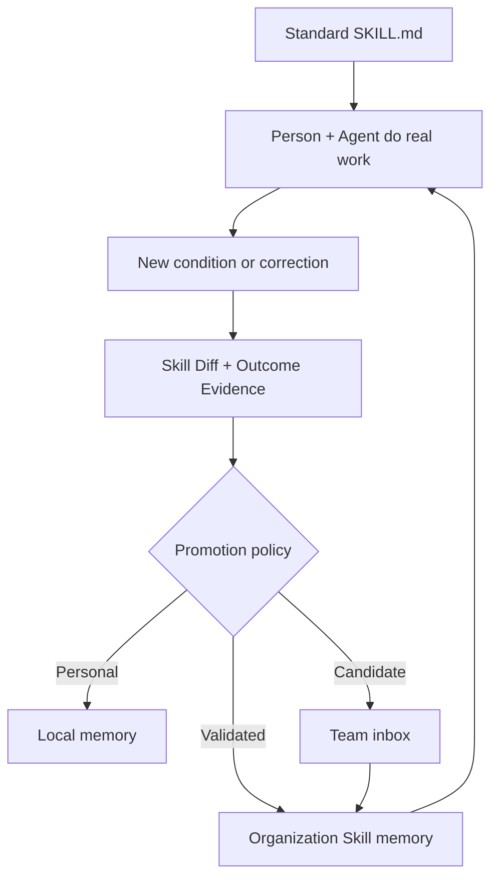
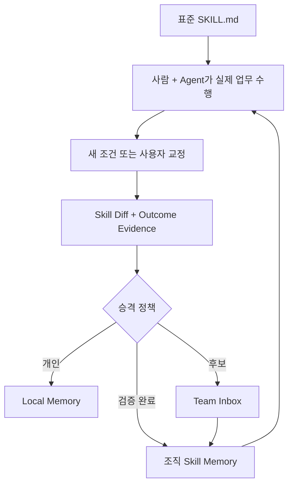

# ContextCommit

**Turn tacit knowledge in individual prompts into reusable organizational memory.**

Git stores what changed. ContextCommit stores the context that made it change—and
when that context should be reused.

Every time a person makes an Agent's work sharper, they add local knowledge:
a correction, a constraint, a recent fact, a rejected approach, or a decision.
That tacit knowledge usually stays in one person's session.

ContextCommit is a local-first framework that automates four steps:

- **capture** new conditions and logic injected while a Skill is used
- **select** only the reusable Skill Diff instead of saving the full conversation
- **promote** personal context into governed team or organization knowledge
- **apply** relevant published knowledge in another person's Agent session

```bash
npm install -g github:junghoonwoo-stack/context-commit
cd my-work
context-commit init
```

Open Codex or Claude Code and work normally. The first time the Agent asks about
project hooks, open `/hooks` and approve the exact project commands.

No separate LLM API, database, or model configuration is required.

## The gap between a Skill and real work

Organizations can distribute a standard `SKILL.md`, playbook, or workflow.
But actual work immediately diverges from that baseline: new information arrives,
a user corrects the Agent, a customer reacts, a constraint changes, or a better
decision is made.

That gap between the standard Skill and the final outcome is where tacit
knowledge appears. It is already expressed in prompts because each person wants
a better result. Asking people to document and share it again rarely works.

ContextCommit captures that delta as part of the work itself.

| Layer | What it helps with | What remains missing |
| --- | --- | --- |
| Agent session memory | Continue one person's work efficiently | Knowledge stays with that person or Agent |
| Personal LLM Wiki | Organize information that may support future work | Information may never enter a real workflow |
| ContextCommit | Promote outcome-changing context across people and Agents | Organization policy decides what may be shared |

## The knowledge unit

ContextCommit does not save every prompt or transcript. It creates a
**Prompt Commit** when a standard Skill changes during real work:

```text
Prompt Commit = Skill Diff + Outcome Evidence + Reuse When
```

- **Skill Diff**: the Base Skill, the condition that appeared, and the logic
  added, changed, or removed
- **Outcome Evidence**: the changed artifact, validation, or user approval that
  shows the new logic helped
- **Reuse When**: when another Agent should apply the Skill Diff
- **Prompt Trajectory**: the correction, fact, or decision that explains where
  the change came from

A Skill Diff is more than a final result. It captures a new branch in the way
work should be done:

```text
Base Skill
+ Condition
+ Logic change
= Adapted workflow
```

The logic change may be a new exception, priority, decision rule, step, or
removed step. At a low level these are IF–ELSE branches; ContextCommit makes
their discovery, validation, promotion, and reuse automatic.



Only validated, low-risk Skill Diffs become published Knowledge and enter
another person's Agent session. This creates **Context Compounding**: each
person's work improves the shared Skill without asking them to maintain a wiki
afterward.

## Two quick examples

| Base Skill | New condition | Skill Diff reused by the organization |
| --- | --- | --- |
| Customer interview summary | Audience is an executive | Put revenue, cost, churn, and the decision needed first; compress feature detail |
| Incident update | Customer communication is required | Remove internal speculation, state customer impact, and include the next update time |

## A first try

Create or open a normal work folder:

```bash
mkdir customer-research
cd customer-research
context-commit init
```

Start Codex or Claude Code in that folder and ask:

```text
Use the customer-interview-summary Skill to summarize interview-notes.md.
```

While reviewing the draft, add:

```text
This is for an executive review. When the audience is executive, put revenue,
cost, churn, and the decision needed first. Compress detailed feature requests.
```

The Agent records the reusable change in `.context-commit/SESSION.md`:

```text
Base Skill: customer-interview-summary
Condition: audience = executive
Logic change: business impact and decision first; feature detail compressed
Outcome Evidence: PM approved the final executive brief
```

ContextCommit saves the **Skill Diff**, not the full conversation. It keeps a
personal change local, routes an unvalidated reusable change to the team Inbox,
or publishes a validated low-risk change as organization Knowledge.

In a later Agent session, another PM asks only:

```text
Summarize this customer interview for the executive review.
```

ContextCommit prepares `.context-commit/CURRENT_CONTEXT.md` with the relevant
published Skill Diff. The Agent applies the executive branch without finding the
original PM or repeating the correction.

Hooks normally handle the lifecycle. Manual commands remain available:

```bash
context-commit start --goal "Summarize a customer interview"
context-commit note --type base_skill "customer-interview-summary"
context-commit note --type skill_diff "When audience is executive, lead with business impact and the decision needed."
context-commit end --summary "Adapted the summary for executives" \
  --reuse-when "Summarizing customer interviews for executives"
```

See [Lifecycle hooks](docs/HOOKS.md) for optional manual and troubleshooting
details.

## What appears in the folder

```text
customer-research/
├── AGENTS.md
├── CLAUDE.md
├── interview-notes.md
├── executive-brief.md
├── context-memory/
│   ├── INDEX.md
│   └── 2026-07-25/
│       └── 10-42-18-adapted-interview-summary-for-executives.md
├── .context-commit/
│   ├── config.json
│   ├── CURRENT_CONTEXT.md
│   └── SESSION.md
├── .codex/
│   └── hooks.json
└── .claude/
    └── settings.json
```

- `AGENTS.md` and `CLAUDE.md` contain the visible, editable memory rules.
- `SESSION.md` is the working note for the current Agent session.
- `context-memory/` contains durable, dated Prompt Commits.
- `CURRENT_CONTEXT.md` is a compact, goal-relevant view prepared for the next
  session.

## The rules the Agent sees

`context-commit init` adds a managed Markdown block to both `AGENTS.md` and
`CLAUDE.md`. Existing content is preserved. The installed rule explicitly
applies to every Skill and workflow used in the folder.

A shortened example:

```markdown
## ContextCommit

These workspace-wide memory rules apply to every Skill and workflow.

### Start meaningful work

1. Read `.context-commit/CURRENT_CONTEXT.md` first.
2. Open a full Prompt Commit only when its details are needed.
3. Load its file diff only when exact evidence matters.

### During the session

Keep only outcome-changing context in `.context-commit/SESSION.md`:

- the Base Skill or workflow
- the condition that changed its logic
- the step, exception, priority, or decision rule added, changed, or removed
- outcome evidence and validation
- when the Skill Diff will be useful again

Do not record raw conversations, credentials, or unnecessary personal data.

### Finish meaningful work

After validation, save a Prompt Commit. Do not create one for a trivial
exchange or work with no reusable Skill Diff or outcome evidence.
```

This is the harness. A team can inspect and adapt these rules directly instead
of depending on an opaque memory system. Because the rule is workspace-wide,
a coding Skill, an email-writing Skill, a spreadsheet Skill, and a research
Skill all use the same memory lifecycle.

## What `SESSION.md` looks like

The Agent maintains a structured draft during the work:

```markdown
# Active ContextCommit Session

Goal: Summarize a customer interview for executive review

## Summary

Adapted the standard interview summary for an executive audience.

## Base Skill

- customer-interview-summary

## Skill Diff

- Condition: audience = executive
- Logic change: lead with revenue, cost, churn, and the decision needed
- Logic change: compress detailed feature requests

## Outcome Evidence

- The PM approved the final executive brief.

## Prompt Trajectory

- The user corrected the general-purpose summary after identifying the audience.

## Validation

- Confirmed the brief contains business impact, evidence, and a clear decision.

## Reuse When

- Summarizing customer interviews for executives.

## Metadata

Topics: customer research, executive brief
Entities: customer-interview-summary
Sensitivity: internal
Confidence: confirmed
```

This is not a transcript or an ever-growing list of exceptions. It is one
reusable conditional change to a shared Skill.

## What `CURRENT_CONTEXT.md` looks like

At the start of the next task, ContextCommit selects relevant published Skill
Diffs and creates lightweight cards:

```markdown
# Current Context

Goal: Summarize a customer interview for executive review

## Adapted interview summaries for executives

- Source: `organization:customer-research/2026-07-26/adapted-interview-summary.md`
- Metadata: topics: customer research, executive brief ·
  confidence: confirmed · sensitivity: internal
- Reuse when: Summarizing customer interviews for executives.
- Details: `context-commit show "organization:customer-research/2026-07-26/adapted-interview-summary.md"`

### Skill Diff

- Condition: audience = executive
- Lead with revenue, cost, churn, and the decision needed.
- Compress detailed feature requests.

### Outcome Evidence

- The PM approved the final executive brief.
```

Only the compact card enters the active context first.

Only the compact card enters the active context first. The complete Prompt
Commit and exact file diff stay on disk and are opened only when needed:

```text
CURRENT_CONTEXT.md
    → context-commit show "<source>"
        → context-commit show "<source>" --section diff
```

This is **progressive disclosure**: save the durable record without loss, but
spend context-window space only on what the current task needs.

## A session pattern that compounds

ContextCommit follows the spirit of Andrej Karpathy's
[LLM Wiki pattern](https://gist.github.com/karpathy/442a6bf555914893e9891c11519de94f):
use LLMs to build persistent, inspectable Markdown knowledge that becomes more
useful over time, instead of rediscovering the same knowledge from raw material
for every question.

ContextCommit is not a full wiki implementation. It applies the same pattern to
AI work sessions:

| LLM Wiki idea | ContextCommit |
| --- | --- |
| Raw sources and work | The files and materials in the work folder |
| Persistent Markdown knowledge | Dated Prompt Commits in `context-memory/` |
| Schema that guides the LLM | Visible rules in `AGENTS.md` and `CLAUDE.md` |
| Index before deeper reading | `INDEX.md` and the goal-specific `CURRENT_CONTEXT.md` |
| Knowledge improves through use | Each meaningful session adds a new, reusable delta |

The compaction approach also borrows from
[OpenClaw's distinction between memory and active context](https://docs.openclaw.ai/concepts/context)
and its
[pre-compaction memory flush](https://docs.openclaw.ai/concepts/memory):
write important state to durable files before a session disappears, keep the
original record inspectable, and load a compact working set into the model.

In practice:

1. `SESSION.md` collects the useful delta while the work is fresh.
2. A Prompt Commit preserves that delta as durable Markdown.
3. `CURRENT_CONTEXT.md` compiles only relevant summaries and decisions for the
   new goal.
4. Full details and diffs are progressively disclosed.
5. Newer Prompt Commits can correct or supersede older context without deleting
   the history.

The result grows like a work wiki, while the active context stays small.

## It works for code and office work

ContextCommit works wherever an Agent produces or changes meaningful work in a
folder:

- code changes, architecture decisions, tests, and incident fixes
- API integrations, migrations, and pull-request follow-ups
- strategy documents and executive briefs
- meeting decisions and follow-up actions
- customer research, interview synthesis, and proposals
- budgets, spreadsheet assumptions, and recurring analyses
- policies, operating procedures, and compliance reviews
- presentations and narrative revisions
- project plans, handoffs, and status reports
- recruiting, onboarding, and internal communications
- competitive research and due diligence

The work product can change from one session to the next. The reusable unit is the Skill Diff that made the workflow work better under a
specific condition.

| Work | Context worth committing |
| --- | --- |
| Software | Architecture constraints, rejected approaches, compatibility rules, and validation |
| Finance | Assumptions, exclusions, data corrections, and reconciliation rules |
| Sales | Customer priorities, objections, decision criteria, and approved claims |
| Operations | Exceptions, ownership, escalation rules, and process changes |
| Research and policy | Source judgments, definitions, scope limits, and unresolved questions |

These examples are not tied to one company, country, or industry. The same
pattern works in a US startup repository, a Korean enterprise network drive, or
an individual's local work folder.

## Promote personal context into organization memory

Point ContextCommit to one network or synchronized folder:

```powershell
context-commit init --shared "Z:\Company Context"
```

```bash
context-commit init --shared "/Volumes/Company Context"
```

The path can be a network drive, synchronized SharePoint folder, or checked-out
private Git directory. ContextCommit always saves locally first. It then applies
the built-in `skill-diff-v1` policy:

- no reusable Skill Diff or outcome evidence → do not save
- outcome evidence without a Skill Diff, or personal/sensitive context → keep local
- reusable but unvalidated context → shared `inbox/`
- reusable, validated, low-risk context → shared `knowledge/`

Only `knowledge/` is injected into another person's Agent session.

Add team and member names only when needed:

```bash
context-commit init --shared "/path/to/context" \
  --team "payments" --member "alex"
```

For an organization-wide workspace, an administrator can set the policy once:

```bash
context-commit init --shared "/path/to/context" \
  --team "platform" --promotion-target organization
```

See [Organization memory](docs/ORGANIZATION_MEMORY.md) for access control,
folder layout, and synchronization notes.

Agent session files can help recover or backfill the causal Prompt Trajectory,
but they are input sources—not shared memory. `context-commit sources` detects
known local roots using metadata only. It does not read, import, or share
session contents. See [Agent session sources](docs/SESSION_SOURCES.md), whose
path registry references
[akm-eval runtime paths](https://github.com/johnfkoo951/akm-eval/blob/main/references/runtime-paths.md).

## Privacy and license

ContextCommit does not upload data or call an LLM. Automated redaction is not a
complete security boundary, so review Markdown before sharing it.

ContextCommit is licensed under [Apache 2.0](LICENSE). Individuals and companies
may use, modify, and distribute it, including internally and commercially.
Required license and notices must remain when redistributing. Prompt Commits and
company memory created with ContextCommit do not have to be published.

More details:
[Prompt Commit format](docs/PROMPT_COMMIT_FORMAT.md) ·
[Lifecycle hooks](docs/HOOKS.md) ·
[Organization memory](docs/ORGANIZATION_MEMORY.md) ·
[Agent session sources](docs/SESSION_SOURCES.md)

---

## 왜 ContextCommit인가

**개인의 Prompt에 담긴 암묵지를 재사용 가능한 조직 Memory로 전환합니다.**

Git이 무엇이 바뀌었는지를 저장한다면, ContextCommit은 왜 바뀌었는지와
그 맥락을 언제 다시 적용해야 하는지를 저장합니다.

사람이 Agent의 결과를 뾰족하게 만들 때마다 교정, 제약조건, 최신 정보,
버린 접근, 의사결정을 Prompt로 주입합니다. 이 암묵지는 대부분 한 사람의
Agent 세션에만 남습니다.

ContextCommit은 다음 네 단계를 자동화하는 Local-first Framework입니다.

- 결과를 실제로 바꾼 Context를 **수집**
- 전체 대화가 아닌 재사용 가능한 Delta만 **선별**
- 개인 Context를 팀·조직 Knowledge로 **승격**
- 관련된 Published Knowledge를 다른 사람의 Agent에 **적용**

```bash
npm install -g github:junghoonwoo-stack/context-commit
cd my-work
context-commit init
```

Codex 또는 Claude Code를 열고 평소처럼 일하면 됩니다. 처음 프로젝트
Hook 승인이 필요할 때 `/hooks`를 열어 정확한 명령을 한 번 확인하고
승인합니다.

별도의 LLM API, 데이터베이스, 모델 설정은 필요하지 않습니다.

## 표준 Skill과 실제 업무 사이

조직은 표준 `SKILL.md`, Playbook, Workflow를 만들어 배포할 수 있습니다.
그러나 실제 업무를 수행하는 순간 새로운 정보가 들어오고, 사용자가
Agent를 교정하고, 고객이 반응하고, 제약조건과 의사결정이 달라집니다.

표준 Skill과 최종 Outcome 사이의 이 차이에 개인의 암묵지가 생깁니다.
구성원은 더 나은 결과를 얻기 위해 이미 이를 Prompt에 표현하고 있습니다.
업무가 끝난 뒤 다시 정리하고 공유하라고 요구하는 방식은 잘 작동하지
않습니다.

ContextCommit은 업무 중 발생한 이 Delta를 그대로 수집합니다.

| Layer | 주된 역할 | 남는 한계 |
| --- | --- | --- |
| Agent Session Memory | 한 사람의 업무를 효율적으로 이어감 | 지식이 개인이나 특정 Agent에 머묾 |
| Personal LLM Wiki | 당장 업무와 별도로 들어오는 정보를 체계화 | 실제 Workflow에 적용되지 않을 수 있음 |
| ContextCommit | Outcome을 바꾼 Context를 사람과 Agent 사이에 승격·재사용 | 무엇을 공유할지는 조직 정책이 결정 |

## Skill Diff: 저장하는 지식 단위

모든 Prompt나 대화를 저장하지 않습니다. 표준 Skill이 실제 업무 중
달라졌을 때만 **Prompt Commit**을 만듭니다.

```text
Prompt Commit = Skill Diff + Outcome Evidence + Reuse When
```

- **Skill Diff**: 어떤 Base Skill에 어떤 조건이 생겼고, 로직이 어떻게
  추가·변경·삭제되었는지
- **Outcome Evidence**: 산출물 변화, 검증, 사용자 승인 등 새 로직이
  유효했음을 보여주는 근거
- **Reuse When**: 다른 Agent가 이 Skill Diff를 적용할 조건
- **Prompt Trajectory**: 변화의 출처가 된 교정, 사실, 의사결정

```text
Base Skill
+ Condition
+ Logic change
= 상황에 맞게 변형된 Workflow
```

Logic change는 예외 추가, 우선순위 변경, 판단 기준 변경, 단계 추가·삭제일
수 있습니다. 낮은 수준에서는 IF–ELSE가 늘어나는 것이지만,
ContextCommit은 그 조건의 발견·검증·승격·재사용을 자동화합니다.



검증된 저위험 Skill Diff만 Published Knowledge가 되어 다른 사람의 Agent에
주입됩니다. 구성원이 업무 후 Wiki를 따로 관리하지 않아도, 한 사람의
경험이 공용 Skill을 계속 개선하는 **Context Compounding**이 생깁니다.

## 두 가지 사례

| Base Skill | 새로 발견된 조건 | 조직이 재사용하는 Skill Diff |
| --- | --- | --- |
| 고객 인터뷰 요약 | 독자가 임원 | 매출·비용·이탈 영향과 필요한 의사결정을 먼저 제시하고 기능 세부사항은 축약 |
| 장애 상황 공유 | 고객에게 전달하는 문서 | 내부 추측은 제거하고 고객 영향과 다음 업데이트 시간을 명시 |

## 처음 사용해 보기

일반 업무 폴더를 만들거나 엽니다.

```bash
mkdir customer-research
cd customer-research
context-commit init
```

Codex 또는 Claude Code를 시작하고 요청합니다.

```text
customer-interview-summary Skill을 사용해 interview-notes.md를 요약해줘.
```

초안을 검토하며 다음 조건을 추가합니다.

```text
이번 문서는 임원 보고용이야. 독자가 임원이면 매출·비용·고객 이탈 영향과
필요한 의사결정을 먼저 보여줘. 세부 기능 요청은 줄여줘.
```

Agent는 `.context-commit/SESSION.md`에 재사용할 변화만 남깁니다.

```text
Base Skill: customer-interview-summary
Condition: audience = executive
Logic change: 사업 영향과 의사결정을 먼저 제시, 기능 세부사항 축약
Outcome Evidence: PM이 최종 임원 보고용 요약을 승인
```

ContextCommit은 전체 대화가 아니라 **Skill Diff**를 저장합니다. 개인적
변화는 Local에 두고, 검증 전 재사용 후보는 Team Inbox로, 검증된 저위험
변화는 조직 Knowledge로 승격합니다.

이후 다른 PM은 다음과 같이만 요청합니다.

```text
이 고객 인터뷰를 임원 보고용으로 요약해줘.
```

ContextCommit이 관련 Published Skill Diff를
`.context-commit/CURRENT_CONTEXT.md`에 준비합니다. 원래 담당자를 찾거나
같은 교정을 반복하지 않아도 Agent가 임원용 분기를 적용합니다.

Hook이 Lifecycle을 자동 처리합니다. 필요하면 수동 명령도 사용할 수
있습니다.

```bash
context-commit start --goal "고객 인터뷰 요약"
context-commit note --type base_skill "customer-interview-summary"
context-commit note --type skill_diff "독자가 임원이면 사업 영향과 의사결정을 먼저 제시"
context-commit end --summary "임원용 요약 로직 적용" \
  --reuse-when "고객 인터뷰를 임원 보고용으로 요약할 때"
```

자세한 수동 사용법과 문제 해결은 [Lifecycle hooks](docs/HOOKS.md)를
참고하십시오.

## 생성되는 폴더와 파일

```text
customer-research/
├── AGENTS.md
├── CLAUDE.md
├── interview-notes.md
├── executive-brief.md
├── context-memory/
│   ├── INDEX.md
│   └── 2026-07-25/
│       └── 10-42-18-임원용-인터뷰-요약-로직.md
├── .context-commit/
│   ├── config.json
│   ├── CURRENT_CONTEXT.md
│   └── SESSION.md
├── .codex/
│   └── hooks.json
└── .claude/
    └── settings.json
```

- `AGENTS.md`, `CLAUDE.md`: 사람이 직접 확인하고 수정할 수 있는 규칙
- `SESSION.md`: 현재 Agent 세션의 작업 Memory
- `context-memory/`: 날짜별로 누적되는 Prompt Commit
- `CURRENT_CONTEXT.md`: 다음 업무 목표에 맞게 작게 취합한 현재 Context

## `AGENTS.md`와 `CLAUDE.md`에 들어가는 규칙

`context-commit init`은 두 파일에 관리 가능한 Markdown 블록을
추가합니다. 기존 내용은 보존되며, 이 규칙은 해당 폴더에서 사용하는 모든
Skill과 업무 흐름에 공통으로 적용됩니다.

축약된 예시는 다음과 같습니다.

```markdown
## ContextCommit

이 Workspace의 Memory 규칙은 모든 Skill과 업무에 적용한다.

### 의미 있는 작업 시작

1. 먼저 `.context-commit/CURRENT_CONTEXT.md`만 읽는다.
2. 세부 내용이 필요할 때만 전체 Prompt Commit을 연다.
3. 정확한 근거가 필요할 때만 파일 Diff를 읽는다.

### 세션 진행 중

결과를 바꾸는 내용만 `.context-commit/SESSION.md`에 유지한다.

- 결정과 제약조건
- 결과에 영향을 준 최신 사실
- 의미 있는 사용자 교정
- 검증 결과
- 미래에 다시 활용할 조건

전체 대화, 인증정보, 불필요한 개인정보는 기록하지 않는다.

### 의미 있는 작업 종료

검증 후 Prompt Commit을 저장한다. 단순 질의나 재사용할 결과가 없는
작업은 저장하지 않는다.
```

이 규칙 자체가 ContextCommit의 Harness입니다. 보이지 않는 Memory
시스템에 의존하지 않고 조직이 직접 읽고 고칠 수 있습니다. Workspace
전체에 적용되므로 Coding Skill, 이메일 작성 Skill, 스프레드시트 Skill,
리서치 Skill이 모두 같은 Memory 흐름을 따릅니다.

## `SESSION.md` 사례

업무 중 Agent가 다음 구조를 유지합니다.

```markdown
# Active ContextCommit Session

Goal: 고객 인터뷰 임원 보고용 요약

## Summary

일반 고객 인터뷰 요약 Skill을 임원 독자에 맞게 변형함.

## Base Skill

- customer-interview-summary

## Skill Diff

- Condition: audience = executive
- Logic change: 매출·비용·이탈 영향과 필요한 의사결정을 먼저 제시
- Logic change: 세부 기능 요청은 축약

## Outcome Evidence

- PM이 최종 임원 보고용 요약을 승인함.

## Prompt Trajectory

- 사용자가 초안 검토 중 독자가 임원임을 명시하고 구조를 교정함.

## Validation

- 사업 영향, 근거 발언, 의사결정 사항이 포함됐는지 확인함.

## Reuse When

- 고객 인터뷰를 임원 보고용으로 요약할 때.

## Metadata

Topics: 고객 조사, 임원 보고
Entities: customer-interview-summary
Sensitivity: internal
Confidence: confirmed
```

전체 대화나 무한히 늘어나는 예외 목록이 아니라, 공용 Skill에 적용할 수
있는 하나의 조건부 변화입니다.

## `CURRENT_CONTEXT.md` 사례

다음 업무가 시작되면 ContextCommit은 관련 Published Skill Diff를 찾아 작은
카드로 취합합니다.

```markdown
# Current Context

Goal: 고객 인터뷰 임원 보고용 요약

## 임원용 인터뷰 요약 로직

- Source: `organization:customer-research/2026-07-26/임원용-인터뷰-요약.md`
- Metadata: topics: 고객 조사, 임원 보고 ·
  confidence: confirmed · sensitivity: internal
- Reuse when: 고객 인터뷰를 임원 보고용으로 요약할 때
- Details: `context-commit show "organization:customer-research/2026-07-26/임원용-인터뷰-요약.md"`

### Skill Diff

- Condition: audience = executive
- 매출·비용·이탈 영향과 필요한 의사결정을 먼저 제시
- 세부 기능 요청은 축약

### Outcome Evidence

- PM이 최종 임원 보고용 요약을 승인함.
```

처음에는 이 작은 카드만 Agent의 활성 Context에 들어갑니다.

처음에는 이 작은 카드만 Agent의 활성 Context에 들어갑니다. 전체 Prompt
Commit과 실제 파일 Diff는 디스크에 보존되며 필요할 때만 엽니다.

```text
CURRENT_CONTEXT.md
    → context-commit show "<source>"
        → context-commit show "<source>" --section diff
```

즉, 원본 기록은 손실 없이 남기되 현재 업무에 필요한 만큼만 Context
Window를 사용하는 **Progressive Disclosure** 방식입니다.

## 세션이 쌓여 지식이 되는 패턴

ContextCommit은 Andrej Karpathy의
[LLM Wiki 패턴](https://gist.github.com/karpathy/442a6bf555914893e9891c11519de94f)이
제시한 정신을 따릅니다. 매 질문마다 원본 자료에서 지식을 다시
찾아 조립하는 대신, LLM이 지속적이고 검토 가능한 Markdown 지식을
만들어 시간이 갈수록 더 유용해지게 하는 방식입니다.

ContextCommit은 완전한 Wiki 구현체는 아닙니다. 같은 원칙을 AI 업무
세션에 적용합니다.

| LLM Wiki의 개념 | ContextCommit |
| --- | --- |
| 원본 자료와 실제 작업 | 업무 폴더의 파일과 자료 |
| 지속적으로 쌓이는 Markdown 지식 | `context-memory/`의 날짜별 Prompt Commit |
| LLM을 안내하는 Schema | `AGENTS.md`, `CLAUDE.md`의 가시적 규칙 |
| Index를 먼저 읽고 필요한 문서로 이동 | `INDEX.md`, 목표별 `CURRENT_CONTEXT.md` |
| 사용할수록 지식이 개선됨 | 의미 있는 세션마다 새로운 Delta가 추가됨 |

Context를 효율적으로 취합하는 방식은
[OpenClaw가 Memory와 활성 Context를 구분하는 구조](https://docs.openclaw.ai/concepts/context)와
[Compaction 전에 중요한 내용을 Memory 파일에 쓰는 방식](https://docs.openclaw.ai/concepts/memory)도
참고합니다. 세션이 사라지기 전에 중요한 상태를 지속 가능한 파일에
기록하고, 원본은 사람이 검토할 수 있게 보존하며, 모델에는 작게 취합된
현재 작업 Context만 제공합니다.

실제 흐름은 다음과 같습니다.

1. `SESSION.md`가 업무 중 새롭게 생긴 Delta를 모음
2. Prompt Commit이 이를 지속 가능한 Markdown으로 보존
3. `CURRENT_CONTEXT.md`가 새 목표에 맞는 요약과 결정만 취합
4. 세부 내용과 Diff는 필요한 경우에만 단계적으로 공개
5. 새로운 Prompt Commit이 과거 Context를 교정하거나 대체하더라도 이력은
   삭제하지 않음

따라서 지식은 업무 Wiki처럼 계속 쌓이지만 활성 Context는 작게 유지됩니다.

## 코딩과 모든 사무 업무에 적용

Agent가 폴더 안에서 의미 있는 결과를 만들거나 수정하는 업무라면 적용할
수 있습니다.

- 코드 수정, Architecture 결정, Test, 장애 대응
- API 연동, Migration, Pull Request 후속 조치
- 전략 문서와 임원 보고
- 회의 결정사항과 후속 조치
- 고객 조사, 인터뷰 분석, 제안서
- 예산, 스프레드시트 가정, 반복 분석
- 정책, 업무 절차, 컴플라이언스 검토
- 프레젠테이션과 스토리라인 수정
- 프로젝트 계획, 인수인계, 현황 보고
- 채용, 온보딩, 사내 커뮤니케이션
- 경쟁사 분석과 Due Diligence

매번 만드는 산출물은 달라도 됩니다. 다음 업무에 재사용되는 것은 그
산출물을 정확하게 만든 Context입니다.

| 업무 | Commit할 가치가 있는 Context |
| --- | --- |
| Software | Architecture 제약, 버린 대안, 호환성 규칙, 검증 결과 |
| 재무 | 가정, 제외 기준, Data 교정, 대사 규칙 |
| 영업 | 고객 우선순위, 반론, 의사결정 기준, 승인된 Claim |
| 운영 | 예외 상황, 담당자, Escalation 규칙, Process 변경 |
| Research·정책 | 출처 판단, 정의, 범위 제한, 미해결 질문 |

특정 회사, 국가, 산업에 종속된 방식이 아닙니다. 미국 Startup의 Code
Repository, 한국 기업의 Network Drive, 개인의 Local 업무 폴더에서 같은
패턴으로 사용할 수 있습니다.

## 개인 Context를 조직 Memory로 승격하기

네트워크 또는 동기화 폴더 경로 하나만 지정합니다.

```powershell
context-commit init --shared "Z:\Company Context"
```

```bash
context-commit init --shared "/Volumes/Company Context"
```

네트워크 드라이브, 동기화된 SharePoint 폴더, 체크아웃한 Private Git
디렉터리를 사용할 수 있습니다. ContextCommit은 항상 개인 폴더에 먼저
저장한 뒤 `skill-diff-v1` 정책을 자동 적용합니다.

- 재사용할 Skill Diff가 없음 → 저장하지 않음
- Skill Diff 없는 결과 근거 또는 개인적·민감한 Context → Local에만 저장
- 재사용 가능하지만 검증되지 않음 → 공유 `inbox/`
- 재사용 가능하고 검증된 저위험 Context → 공유 `knowledge/`

다른 사람의 Agent에는 `knowledge/`만 자동 주입됩니다.

필요한 경우에만 팀과 구성원 이름을 추가합니다.

```bash
context-commit init --shared "/path/to/context" \
  --team "payments" --member "minji"
```

조직 전체에 적용할 Workspace는 관리자가 정책을 한 번 설정합니다.

```bash
context-commit init --shared "/path/to/context" \
  --team "platform" --promotion-target organization
```

권한, 폴더 구조, 동기화 방식은
[Organization memory](docs/ORGANIZATION_MEMORY.md)에서 확인할 수
있습니다.

Agent 세션 파일은 누락된 Prompt Trajectory를 복구하거나 과거 업무를
Backfill하는 입력원으로 도움이 됩니다. 다만 그 자체가 공유 Memory는
아닙니다. `context-commit sources`는 알려진 Local 경로의 메타데이터만
탐지하며, 세션 내용을 읽거나 가져오거나 공유하지 않습니다. 자세한
내용은 [Agent session sources](docs/SESSION_SOURCES.md)를 참고하십시오.
경로 목록은
[akm-eval runtime paths](https://github.com/johnfkoo951/akm-eval/blob/main/references/runtime-paths.md)를
참고했습니다.

## 개인정보와 라이선스

ContextCommit은 데이터를 업로드하거나 LLM을 호출하지 않습니다. 자동
비밀정보 제거는 완전한 보안 장치가 아니므로 공유 전 Markdown을
확인해야 합니다.

[Apache 2.0](LICENSE) 라이선스로 제공됩니다. 개인과 기업 모두 내부 및
상업적 사용, 수정, 재배포가 가능합니다. 재배포 시 필요한 라이선스와
고지를 유지해야 합니다. ContextCommit으로 만든 Prompt Commit이나 회사
Memory를 공개할 의무는 없습니다.

더 보기:
[Prompt Commit format](docs/PROMPT_COMMIT_FORMAT.md) ·
[Lifecycle hooks](docs/HOOKS.md) ·
[Organization memory](docs/ORGANIZATION_MEMORY.md) ·
[Agent session sources](docs/SESSION_SOURCES.md)
