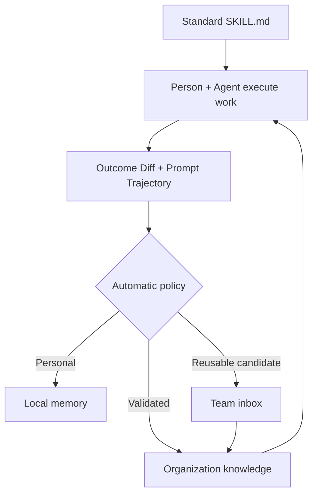
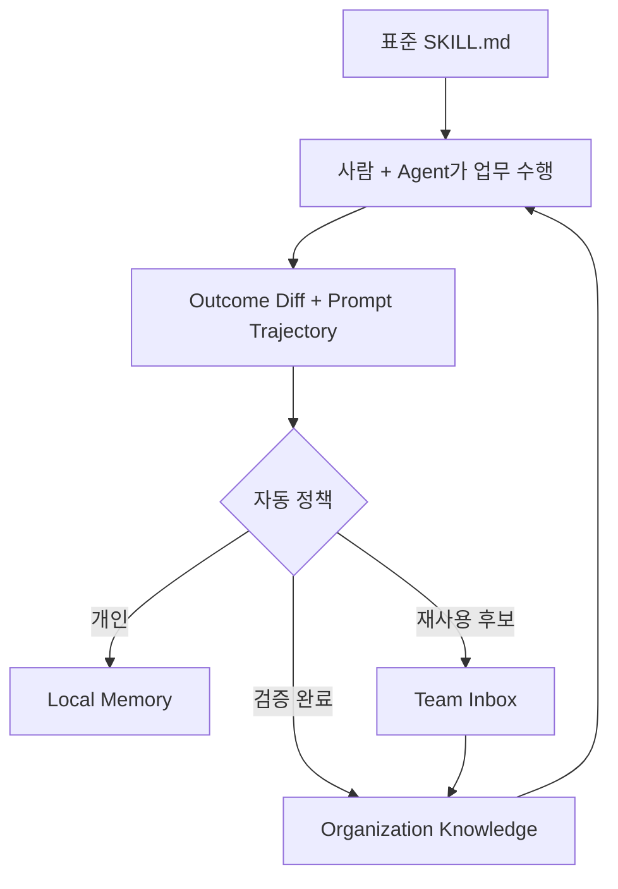

# ContextCommit

**Turn tacit knowledge in individual prompts into reusable organizational memory.**

Git stores what changed. ContextCommit stores the context that made it change—and
when that context should be reused.

Every time a person makes an Agent's work sharper, they add local knowledge:
a correction, a constraint, a recent fact, a rejected approach, or a decision.
That tacit knowledge usually stays in one person's session.

ContextCommit is a local-first framework that automates four steps:

- **capture** the context that materially changed an outcome
- **select** only the reusable delta instead of saving the full conversation
- **promote** personal context into governed team or organization knowledge
- **apply** relevant published knowledge in another person's Agent session

```bash
npm install -g github:junghoonwoo-stack/context-commit
cd my-work
context-commit init
```

Open Codex or Claude Code and work normally. The first time the Agent asks about
project hooks, open `/hooks` and approve the exact project commands.

No separate LLM API, database, or model configuration is required.

## The gap between a Skill and real work

Organizations can distribute a standard `SKILL.md`, playbook, or workflow.
But actual work immediately diverges from that baseline: new information arrives,
a user corrects the Agent, a customer reacts, a constraint changes, or a better
decision is made.

That gap between the standard Skill and the final outcome is where tacit
knowledge appears. It is already expressed in prompts because each person wants
a better result. Asking people to document and share it again rarely works.

ContextCommit captures that delta as part of the work itself.

| Layer | What it helps with | What remains missing |
| --- | --- | --- |
| Agent session memory | Continue one person's work efficiently | Knowledge stays with that person or Agent |
| Personal LLM Wiki | Organize information that may support future work | Information may never enter a real workflow |
| ContextCommit | Promote outcome-changing context across people and Agents | Organization policy decides what may be shared |

## The knowledge unit

ContextCommit does not save every prompt or transcript. It creates a
**Prompt Commit** only when work contains a reusable change:

```text
Prompt Commit = Outcome Diff + causal Prompt Trajectory + validation + Reuse When
```

- **Outcome Diff**: what materially changed in the artifact, decision, or action
- **Prompt Trajectory**: the facts, corrections, constraints, and decisions that
  caused the change
- **Validation**: evidence that the result works
- **Reuse When**: the condition under which another Agent should apply it



The workspace policy handles promotion. Noise is discarded, personal or
sensitive context stays local, unvalidated reusable work goes to the team Inbox,
and validated low-risk context becomes published Knowledge. Only published
Knowledge is injected into another person's Agent session.

This creates **Context Compounding**: one person's work makes many future Agent
sessions sharper without requiring that person to maintain a wiki or answer the
same questions repeatedly.

## Two quick examples

| Role | Tacit knowledge captured during work | What the organization reuses |
| --- | --- | --- |
| Developer | “The provider retries events out of order. Use its stable event ID and preserve the public API contract.” | The next Coding Agent applies the same idempotency rule when adding refund webhooks. |
| Product manager | “Enterprise rollout requires security approval before the pilot can expand.” | The next PRD or proposal Agent includes the approval gate without finding the original PM. |

## A first try

Create or open a normal work folder:

```bash
mkdir billing-service
cd billing-service
context-commit init
```

Start Codex or Claude Code in that folder and ask:

```text
Fix the duplicate invoice records created when payment webhooks are retried.
```

While reviewing the draft, add:

```text
The provider can deliver the same event more than once and out of order.
Use its stable event ID for idempotency, preserve the current API contract,
and add a regression test for legacy records.
```

The Agent works on the code and keeps only the outcome-changing context in
`.context-commit/SESSION.md`. When meaningful work finishes, ContextCommit
evaluates the Outcome Diff, its causal context, validation, reuse condition, and
sensitivity. It then discards noise, keeps personal context local, sends a
reusable unvalidated item to the team Inbox, or publishes validated context.

In a later Agent session, ask only:

```text
Add support for refund webhooks.
```

ContextCommit prepares a small `.context-commit/CURRENT_CONTEXT.md` containing
the relevant prior decision. You do not have to repeat the event-ID,
out-of-order delivery, or compatibility constraints.

Hooks normally handle the lifecycle. Manual commands remain available:

```bash
context-commit start --goal "Fix duplicate webhook processing"
context-commit end --summary "Made payment webhooks idempotent by event ID"
```

See [Lifecycle hooks](docs/HOOKS.md) for the optional manual and troubleshooting
details.

## What appears in the folder

```text
billing-service/
├── AGENTS.md
├── CLAUDE.md
├── src/
├── test/
├── context-memory/
│   ├── INDEX.md
│   └── 2026-07-25/
│       └── 10-42-18-made-payment-webhooks-idempotent.md
├── .context-commit/
│   ├── config.json
│   ├── CURRENT_CONTEXT.md
│   └── SESSION.md
├── .codex/
│   └── hooks.json
└── .claude/
    └── settings.json
```

- `AGENTS.md` and `CLAUDE.md` contain the visible, editable memory rules.
- `SESSION.md` is the working note for the current Agent session.
- `context-memory/` contains durable, dated Prompt Commits.
- `CURRENT_CONTEXT.md` is a compact, goal-relevant view prepared for the next
  session.

## The rules the Agent sees

`context-commit init` adds a managed Markdown block to both `AGENTS.md` and
`CLAUDE.md`. Existing content is preserved. The installed rule explicitly
applies to every Skill and workflow used in the folder.

A shortened example:

```markdown
## ContextCommit

These workspace-wide memory rules apply to every Skill and workflow.

### Start meaningful work

1. Read `.context-commit/CURRENT_CONTEXT.md` first.
2. Open a full Prompt Commit only when its details are needed.
3. Load its file diff only when exact evidence matters.

### During the session

Keep only outcome-changing context in `.context-commit/SESSION.md`:

- decisions and constraints
- current facts that materially changed the work
- meaningful user corrections
- validation results
- when the context will be useful again

Do not record raw conversations, credentials, or unnecessary personal data.

### Finish meaningful work

After validation, save a Prompt Commit. Do not create one for a trivial
exchange or work with no reusable outcome.
```

This is the harness. A team can inspect and adapt these rules directly instead
of depending on an opaque memory system. Because the rule is workspace-wide,
a coding Skill, an email-writing Skill, a spreadsheet Skill, and a research
Skill all use the same memory lifecycle.

## What `SESSION.md` looks like

The Agent maintains a structured draft during the work:

```markdown
# Active ContextCommit Session

Goal: Fix duplicate payment webhook processing

## Summary

Made webhook processing idempotent while preserving the public API contract.

## Context That Mattered

- The provider can deliver the same event more than once and out of order.
- Existing records may not contain the new idempotency key.

## Decisions

- Use the provider's stable event ID as the idempotency key.
- Add a database uniqueness constraint and use an idempotent upsert.
- Preserve compatibility for legacy records and the current API contract.

## Prompt Trajectory

- The user corrected the initial timestamp-based deduplication approach.
- The user added the legacy-record compatibility constraint.

## Validation

- Added tests for duplicate, delayed, and out-of-order delivery.
- Verified the existing API contract and migration path.

## Reuse When

- Implementing or reviewing payment webhook handlers.

## Metadata

Topics: payments, webhooks, idempotency
Entities: payment event ID, invoice record
Sensitivity: internal
Confidence: confirmed
```

This is not a transcript. It is a small working memory of what changed the
outcome.

## What `CURRENT_CONTEXT.md` looks like

At the start of the next task, ContextCommit selects relevant Prompt Commits and
creates lightweight cards:

```markdown
# Current Context

Goal: Add support for refund webhooks

## Made payment webhooks idempotent by event ID

- Source: `local:2026-07-25/10-42-18-made-webhooks-idempotent.md`
- Metadata: topics: payments, webhooks, idempotency ·
  confidence: confirmed · sensitivity: internal
- Reuse when: Implementing or reviewing payment webhook handlers.
- Details: `context-commit show "local:2026-07-25/10-42-18-made-webhooks-idempotent.md"`
- Artifact diff: `context-commit show "local:2026-07-25/10-42-18-made-webhooks-idempotent.md" --section diff`

### Decisions

- Use the provider's stable event ID as the idempotency key.
- Preserve compatibility for legacy records and the current API contract.
```

Only the compact card enters the active context first. The complete Prompt
Commit and exact file diff stay on disk and are opened only when needed:

```text
CURRENT_CONTEXT.md
    → context-commit show "<source>"
        → context-commit show "<source>" --section diff
```

This is **progressive disclosure**: save the durable record without loss, but
spend context-window space only on what the current task needs.

## A session pattern that compounds

ContextCommit follows the spirit of Andrej Karpathy's
[LLM Wiki pattern](https://gist.github.com/karpathy/442a6bf555914893e9891c11519de94f):
use LLMs to build persistent, inspectable Markdown knowledge that becomes more
useful over time, instead of rediscovering the same knowledge from raw material
for every question.

ContextCommit is not a full wiki implementation. It applies the same pattern to
AI work sessions:

| LLM Wiki idea | ContextCommit |
| --- | --- |
| Raw sources and work | The files and materials in the work folder |
| Persistent Markdown knowledge | Dated Prompt Commits in `context-memory/` |
| Schema that guides the LLM | Visible rules in `AGENTS.md` and `CLAUDE.md` |
| Index before deeper reading | `INDEX.md` and the goal-specific `CURRENT_CONTEXT.md` |
| Knowledge improves through use | Each meaningful session adds a new, reusable delta |

The compaction approach also borrows from
[OpenClaw's distinction between memory and active context](https://docs.openclaw.ai/concepts/context)
and its
[pre-compaction memory flush](https://docs.openclaw.ai/concepts/memory):
write important state to durable files before a session disappears, keep the
original record inspectable, and load a compact working set into the model.

In practice:

1. `SESSION.md` collects the useful delta while the work is fresh.
2. A Prompt Commit preserves that delta as durable Markdown.
3. `CURRENT_CONTEXT.md` compiles only relevant summaries and decisions for the
   new goal.
4. Full details and diffs are progressively disclosed.
5. Newer Prompt Commits can correct or supersede older context without deleting
   the history.

The result grows like a work wiki, while the active context stays small.

## It works for code and office work

ContextCommit works wherever an Agent produces or changes meaningful work in a
folder:

- code changes, architecture decisions, tests, and incident fixes
- API integrations, migrations, and pull-request follow-ups
- strategy documents and executive briefs
- meeting decisions and follow-up actions
- customer research, interview synthesis, and proposals
- budgets, spreadsheet assumptions, and recurring analyses
- policies, operating procedures, and compliance reviews
- presentations and narrative revisions
- project plans, handoffs, and status reports
- recruiting, onboarding, and internal communications
- competitive research and due diligence

The work product can change from one session to the next. The reusable unit is
the context that made the work correct.

| Work | Context worth committing |
| --- | --- |
| Software | Architecture constraints, rejected approaches, compatibility rules, and validation |
| Finance | Assumptions, exclusions, data corrections, and reconciliation rules |
| Sales | Customer priorities, objections, decision criteria, and approved claims |
| Operations | Exceptions, ownership, escalation rules, and process changes |
| Research and policy | Source judgments, definitions, scope limits, and unresolved questions |

These examples are not tied to one company, country, or industry. The same
pattern works in a US startup repository, a Korean enterprise network drive, or
an individual's local work folder.

## Promote personal context into organization memory

Point ContextCommit to one network or synchronized folder:

```powershell
context-commit init --shared "Z:\Company Context"
```

```bash
context-commit init --shared "/Volumes/Company Context"
```

The path can be a network drive, synchronized SharePoint folder, or checked-out
private Git directory. ContextCommit always saves locally first. It then applies
the built-in `outcome-diff-v1` policy:

- no reusable Outcome Diff → do not save
- personal, sensitive, or weakly reusable context → keep local
- reusable but unvalidated context → shared `inbox/`
- reusable, validated, low-risk context → shared `knowledge/`

Only `knowledge/` is injected into another person's Agent session.

Add team and member names only when needed:

```bash
context-commit init --shared "/path/to/context" \
  --team "payments" --member "alex"
```

For an organization-wide workspace, an administrator can set the policy once:

```bash
context-commit init --shared "/path/to/context" \
  --team "platform" --promotion-target organization
```

See [Organization memory](docs/ORGANIZATION_MEMORY.md) for access control,
folder layout, and synchronization notes.

Agent session files can help recover or backfill the causal Prompt Trajectory,
but they are input sources—not shared memory. `context-commit sources` detects
known local roots using metadata only. It does not read, import, or share
session contents. See [Agent session sources](docs/SESSION_SOURCES.md), whose
path registry references
[akm-eval runtime paths](https://github.com/johnfkoo951/akm-eval/blob/main/references/runtime-paths.md).

## Privacy and license

ContextCommit does not upload data or call an LLM. Automated redaction is not a
complete security boundary, so review Markdown before sharing it.

ContextCommit is licensed under [Apache 2.0](LICENSE). Individuals and companies
may use, modify, and distribute it, including internally and commercially.
Required license and notices must remain when redistributing. Prompt Commits and
company memory created with ContextCommit do not have to be published.

More details:
[Prompt Commit format](docs/PROMPT_COMMIT_FORMAT.md) ·
[Lifecycle hooks](docs/HOOKS.md) ·
[Organization memory](docs/ORGANIZATION_MEMORY.md) ·
[Agent session sources](docs/SESSION_SOURCES.md)

---

## 왜 ContextCommit인가

**개인의 Prompt에 담긴 암묵지를 재사용 가능한 조직 Memory로 전환합니다.**

Git이 무엇이 바뀌었는지를 저장한다면, ContextCommit은 왜 바뀌었는지와
그 맥락을 언제 다시 적용해야 하는지를 저장합니다.

사람이 Agent의 결과를 뾰족하게 만들 때마다 교정, 제약조건, 최신 정보,
버린 접근, 의사결정을 Prompt로 주입합니다. 이 암묵지는 대부분 한 사람의
Agent 세션에만 남습니다.

ContextCommit은 다음 네 단계를 자동화하는 Local-first Framework입니다.

- 결과를 실제로 바꾼 Context를 **수집**
- 전체 대화가 아닌 재사용 가능한 Delta만 **선별**
- 개인 Context를 팀·조직 Knowledge로 **승격**
- 관련된 Published Knowledge를 다른 사람의 Agent에 **적용**

```bash
npm install -g github:junghoonwoo-stack/context-commit
cd my-work
context-commit init
```

Codex 또는 Claude Code를 열고 평소처럼 일하면 됩니다. 처음 프로젝트
Hook 승인이 필요할 때 `/hooks`를 열어 정확한 명령을 한 번 확인하고
승인합니다.

별도의 LLM API, 데이터베이스, 모델 설정은 필요하지 않습니다.

## 표준 Skill과 실제 업무 사이

조직은 표준 `SKILL.md`, Playbook, Workflow를 만들어 배포할 수 있습니다.
그러나 실제 업무를 수행하는 순간 새로운 정보가 들어오고, 사용자가
Agent를 교정하고, 고객이 반응하고, 제약조건과 의사결정이 달라집니다.

표준 Skill과 최종 Outcome 사이의 이 차이에 개인의 암묵지가 생깁니다.
구성원은 더 나은 결과를 얻기 위해 이미 이를 Prompt에 표현하고 있습니다.
업무가 끝난 뒤 다시 정리하고 공유하라고 요구하는 방식은 잘 작동하지
않습니다.

ContextCommit은 업무 중 발생한 이 Delta를 그대로 수집합니다.

| Layer | 주된 역할 | 남는 한계 |
| --- | --- | --- |
| Agent Session Memory | 한 사람의 업무를 효율적으로 이어감 | 지식이 개인이나 특정 Agent에 머묾 |
| Personal LLM Wiki | 당장 업무와 별도로 들어오는 정보를 체계화 | 실제 Workflow에 적용되지 않을 수 있음 |
| ContextCommit | Outcome을 바꾼 Context를 사람과 Agent 사이에 승격·재사용 | 무엇을 공유할지는 조직 정책이 결정 |

## 저장하는 지식 단위

모든 Prompt나 대화를 저장하지 않습니다. 재사용할 변화가 있을 때만
**Prompt Commit**을 만듭니다.

```text
Prompt Commit = Outcome Diff + 원인 Prompt Trajectory + 검증 + Reuse When
```

- **Outcome Diff**: 산출물, 판단, 행동에서 실제로 달라진 것
- **Prompt Trajectory**: 변화를 만든 사실, 교정, 제약조건, 의사결정
- **Validation**: 결과가 작동한다는 근거
- **Reuse When**: 다른 Agent가 이 Context를 적용해야 할 조건



Workspace 정책이 승격을 결정합니다. 노이즈는 버리고, 개인적이거나 민감한
Context는 Local에 남기고, 검증되지 않은 재사용 항목은 Team Inbox로,
검증된 저위험 Context는 Published Knowledge로 보냅니다. 다른 사람의
Agent에는 Published Knowledge만 자동 주입됩니다.

이를 통해 한 사람의 업무가 여러 사람의 다음 Agent를 더 뾰족하게 만드는
**Context Compounding**이 생깁니다. 구성원이 Wiki를 따로 관리하거나 같은
질문에 반복해서 답하지 않아도 됩니다.

## 두 가지 사례

| 역할 | 업무 중 수집된 암묵지 | 조직이 재사용하는 방식 |
| --- | --- | --- |
| 개발자 | “결제사는 Event를 순서가 바뀐 상태로 재전송한다. 안정적인 Event ID를 사용하고 공개 API 계약은 유지한다.” | 다음 Coding Agent가 Refund Webhook을 만들 때 같은 멱등성 원칙을 적용 |
| PM | “Enterprise Pilot 확대 전 Security 승인이 필요하다.” | 다음 PRD·제안서 Agent가 원래 담당자를 찾지 않고 Approval Gate를 반영 |

## 처음 사용해 보기

일반 업무 폴더를 만들거나 기존 폴더를 엽니다.

```bash
mkdir billing-service
cd billing-service
context-commit init
```

해당 폴더에서 Codex 또는 Claude Code를 시작하고 요청합니다.

```text
결제 Webhook 재전송 시 중복 Invoice가 생성되는 문제를 수정해줘.
```

초안을 검토하며 다음과 같이 교정합니다.

```text
결제사는 같은 Event를 여러 번, 순서가 바뀐 상태로 보낼 수 있어.
안정적인 Event ID를 멱등성 기준으로 사용하고, 현재 공개 API 계약은
유지해. 기존 레코드에 대한 Regression Test도 추가해줘.
```

Agent는 코드를 수정하면서 결과를 바꾼 맥락만
`.context-commit/SESSION.md`에 유지합니다. 의미 있는 작업이 끝나면
ContextCommit이 Outcome Diff, 원인 맥락, 검증, 재사용 조건, 민감도를
평가해 노이즈는 버리고 개인 저장·공유 후보·조직 Knowledge로 자동
분류합니다.

새로운 Agent 세션에서는 다음과 같이만 요청합니다.

```text
Refund Webhook 지원을 추가해줘.
```

ContextCommit은 이전 결정을 담은 작은
`.context-commit/CURRENT_CONTEXT.md`를 준비합니다. 사용자는 Event ID,
순서가 바뀐 재전송, 기존 API 호환성 제약을 다시 설명하지 않아도 됩니다.

Hook이 일반적인 시작과 종료를 처리합니다. 필요하면 직접 실행할 수도
있습니다.

```bash
context-commit start --goal "Webhook 중복 처리 수정"
context-commit end --summary "Event ID 기반으로 결제 Webhook 멱등성 확보"
```

Hook의 수동 사용과 문제 해결은 [Lifecycle hooks](docs/HOOKS.md)에서
확인할 수 있습니다.

## 생성되는 폴더와 파일

```text
billing-service/
├── AGENTS.md
├── CLAUDE.md
├── src/
├── test/
├── context-memory/
│   ├── INDEX.md
│   └── 2026-07-25/
│       └── 10-42-18-결제-webhook-멱등성-확보.md
├── .context-commit/
│   ├── config.json
│   ├── CURRENT_CONTEXT.md
│   └── SESSION.md
├── .codex/
│   └── hooks.json
└── .claude/
    └── settings.json
```

- `AGENTS.md`, `CLAUDE.md`: 사람이 직접 확인하고 수정할 수 있는 규칙
- `SESSION.md`: 현재 Agent 세션의 작업 Memory
- `context-memory/`: 날짜별로 누적되는 Prompt Commit
- `CURRENT_CONTEXT.md`: 다음 업무 목표에 맞게 작게 취합한 현재 Context

## `AGENTS.md`와 `CLAUDE.md`에 들어가는 규칙

`context-commit init`은 두 파일에 관리 가능한 Markdown 블록을
추가합니다. 기존 내용은 보존되며, 이 규칙은 해당 폴더에서 사용하는 모든
Skill과 업무 흐름에 공통으로 적용됩니다.

축약된 예시는 다음과 같습니다.

```markdown
## ContextCommit

이 Workspace의 Memory 규칙은 모든 Skill과 업무에 적용한다.

### 의미 있는 작업 시작

1. 먼저 `.context-commit/CURRENT_CONTEXT.md`만 읽는다.
2. 세부 내용이 필요할 때만 전체 Prompt Commit을 연다.
3. 정확한 근거가 필요할 때만 파일 Diff를 읽는다.

### 세션 진행 중

결과를 바꾸는 내용만 `.context-commit/SESSION.md`에 유지한다.

- 결정과 제약조건
- 결과에 영향을 준 최신 사실
- 의미 있는 사용자 교정
- 검증 결과
- 미래에 다시 활용할 조건

전체 대화, 인증정보, 불필요한 개인정보는 기록하지 않는다.

### 의미 있는 작업 종료

검증 후 Prompt Commit을 저장한다. 단순 질의나 재사용할 결과가 없는
작업은 저장하지 않는다.
```

이 규칙 자체가 ContextCommit의 Harness입니다. 보이지 않는 Memory
시스템에 의존하지 않고 조직이 직접 읽고 고칠 수 있습니다. Workspace
전체에 적용되므로 Coding Skill, 이메일 작성 Skill, 스프레드시트 Skill,
리서치 Skill이 모두 같은 Memory 흐름을 따릅니다.

## `SESSION.md` 사례

Agent는 작업 중 구조화된 초안을 유지합니다.

```markdown
# Active ContextCommit Session

Goal: 결제 Webhook 중복 처리 수정

## Summary

공개 API 계약을 유지하면서 Webhook 처리를 멱등하게 수정함.

## Context That Mattered

- 결제사는 동일 Event를 여러 번, 순서가 바뀐 상태로 보낼 수 있음.
- 기존 레코드에는 새로운 멱등성 Key가 없을 수 있음.

## Decisions

- 결제사가 제공하는 안정적인 Event ID를 멱등성 Key로 사용함.
- Database Unique Constraint와 Idempotent Upsert를 함께 적용함.
- 기존 레코드와 현재 공개 API 계약의 호환성을 유지함.

## Prompt Trajectory

- 사용자가 Timestamp 기반 중복 제거 방식을 Event ID 기준으로 교정함.
- 기존 레코드 호환성 제약을 추가함.

## Validation

- 중복, 지연, 순서 변경 Event에 대한 Test를 추가함.
- 기존 API 계약과 Migration 경로를 확인함.

## Reuse When

- 결제 Webhook Handler를 구현하거나 Review할 때.

## Metadata

Topics: payments, webhooks, idempotency
Entities: payment event ID, invoice record
Sensitivity: internal
Confidence: confirmed
```

이는 녹취록이나 전체 대화 요약이 아닙니다. 결과를 바꾼 것만 남기는 작은
작업 Memory입니다.

## `CURRENT_CONTEXT.md` 사례

다음 업무가 시작되면 ContextCommit은 관련 Prompt Commit을 찾아 작은
카드로 취합합니다.

```markdown
# Current Context

Goal: Refund Webhook 지원 추가

## Event ID 기반으로 결제 Webhook 멱등성 확보

- Source: `local:2026-07-25/10-42-18-webhook-멱등성-확보.md`
- Metadata: topics: payments, webhooks, idempotency ·
  confidence: confirmed · sensitivity: internal
- Reuse when: 결제 Webhook Handler를 구현하거나 Review할 때
- Details: `context-commit show "local:2026-07-25/10-42-18-webhook-멱등성-확보.md"`
- Artifact diff: `context-commit show "local:2026-07-25/10-42-18-webhook-멱등성-확보.md" --section diff`

### Decisions

- 결제사가 제공하는 안정적인 Event ID를 멱등성 Key로 사용함.
- 기존 레코드와 현재 공개 API 계약의 호환성을 유지함.
```

처음에는 이 작은 카드만 Agent의 활성 Context에 들어갑니다. 전체 Prompt
Commit과 실제 파일 Diff는 디스크에 보존되며 필요할 때만 엽니다.

```text
CURRENT_CONTEXT.md
    → context-commit show "<source>"
        → context-commit show "<source>" --section diff
```

즉, 원본 기록은 손실 없이 남기되 현재 업무에 필요한 만큼만 Context
Window를 사용하는 **Progressive Disclosure** 방식입니다.

## 세션이 쌓여 지식이 되는 패턴

ContextCommit은 Andrej Karpathy의
[LLM Wiki 패턴](https://gist.github.com/karpathy/442a6bf555914893e9891c11519de94f)이
제시한 정신을 따릅니다. 매 질문마다 원본 자료에서 지식을 다시
찾아 조립하는 대신, LLM이 지속적이고 검토 가능한 Markdown 지식을
만들어 시간이 갈수록 더 유용해지게 하는 방식입니다.

ContextCommit은 완전한 Wiki 구현체는 아닙니다. 같은 원칙을 AI 업무
세션에 적용합니다.

| LLM Wiki의 개념 | ContextCommit |
| --- | --- |
| 원본 자료와 실제 작업 | 업무 폴더의 파일과 자료 |
| 지속적으로 쌓이는 Markdown 지식 | `context-memory/`의 날짜별 Prompt Commit |
| LLM을 안내하는 Schema | `AGENTS.md`, `CLAUDE.md`의 가시적 규칙 |
| Index를 먼저 읽고 필요한 문서로 이동 | `INDEX.md`, 목표별 `CURRENT_CONTEXT.md` |
| 사용할수록 지식이 개선됨 | 의미 있는 세션마다 새로운 Delta가 추가됨 |

Context를 효율적으로 취합하는 방식은
[OpenClaw가 Memory와 활성 Context를 구분하는 구조](https://docs.openclaw.ai/concepts/context)와
[Compaction 전에 중요한 내용을 Memory 파일에 쓰는 방식](https://docs.openclaw.ai/concepts/memory)도
참고합니다. 세션이 사라지기 전에 중요한 상태를 지속 가능한 파일에
기록하고, 원본은 사람이 검토할 수 있게 보존하며, 모델에는 작게 취합된
현재 작업 Context만 제공합니다.

실제 흐름은 다음과 같습니다.

1. `SESSION.md`가 업무 중 새롭게 생긴 Delta를 모음
2. Prompt Commit이 이를 지속 가능한 Markdown으로 보존
3. `CURRENT_CONTEXT.md`가 새 목표에 맞는 요약과 결정만 취합
4. 세부 내용과 Diff는 필요한 경우에만 단계적으로 공개
5. 새로운 Prompt Commit이 과거 Context를 교정하거나 대체하더라도 이력은
   삭제하지 않음

따라서 지식은 업무 Wiki처럼 계속 쌓이지만 활성 Context는 작게 유지됩니다.

## 코딩과 모든 사무 업무에 적용

Agent가 폴더 안에서 의미 있는 결과를 만들거나 수정하는 업무라면 적용할
수 있습니다.

- 코드 수정, Architecture 결정, Test, 장애 대응
- API 연동, Migration, Pull Request 후속 조치
- 전략 문서와 임원 보고
- 회의 결정사항과 후속 조치
- 고객 조사, 인터뷰 분석, 제안서
- 예산, 스프레드시트 가정, 반복 분석
- 정책, 업무 절차, 컴플라이언스 검토
- 프레젠테이션과 스토리라인 수정
- 프로젝트 계획, 인수인계, 현황 보고
- 채용, 온보딩, 사내 커뮤니케이션
- 경쟁사 분석과 Due Diligence

매번 만드는 산출물은 달라도 됩니다. 다음 업무에 재사용되는 것은 그
산출물을 정확하게 만든 Context입니다.

| 업무 | Commit할 가치가 있는 Context |
| --- | --- |
| Software | Architecture 제약, 버린 대안, 호환성 규칙, 검증 결과 |
| 재무 | 가정, 제외 기준, Data 교정, 대사 규칙 |
| 영업 | 고객 우선순위, 반론, 의사결정 기준, 승인된 Claim |
| 운영 | 예외 상황, 담당자, Escalation 규칙, Process 변경 |
| Research·정책 | 출처 판단, 정의, 범위 제한, 미해결 질문 |

특정 회사, 국가, 산업에 종속된 방식이 아닙니다. 미국 Startup의 Code
Repository, 한국 기업의 Network Drive, 개인의 Local 업무 폴더에서 같은
패턴으로 사용할 수 있습니다.

## 개인 Context를 조직 Memory로 승격하기

네트워크 또는 동기화 폴더 경로 하나만 지정합니다.

```powershell
context-commit init --shared "Z:\Company Context"
```

```bash
context-commit init --shared "/Volumes/Company Context"
```

네트워크 드라이브, 동기화된 SharePoint 폴더, 체크아웃한 Private Git
디렉터리를 사용할 수 있습니다. ContextCommit은 항상 개인 폴더에 먼저
저장한 뒤 `outcome-diff-v1` 정책을 자동 적용합니다.

- 재사용할 Outcome Diff가 없음 → 저장하지 않음
- 개인적이거나 민감하거나 재사용성이 낮음 → Local에만 저장
- 재사용 가능하지만 검증되지 않음 → 공유 `inbox/`
- 재사용 가능하고 검증된 저위험 Context → 공유 `knowledge/`

다른 사람의 Agent에는 `knowledge/`만 자동 주입됩니다.

필요한 경우에만 팀과 구성원 이름을 추가합니다.

```bash
context-commit init --shared "/path/to/context" \
  --team "payments" --member "minji"
```

조직 전체에 적용할 Workspace는 관리자가 정책을 한 번 설정합니다.

```bash
context-commit init --shared "/path/to/context" \
  --team "platform" --promotion-target organization
```

권한, 폴더 구조, 동기화 방식은
[Organization memory](docs/ORGANIZATION_MEMORY.md)에서 확인할 수
있습니다.

Agent 세션 파일은 누락된 Prompt Trajectory를 복구하거나 과거 업무를
Backfill하는 입력원으로 도움이 됩니다. 다만 그 자체가 공유 Memory는
아닙니다. `context-commit sources`는 알려진 Local 경로의 메타데이터만
탐지하며, 세션 내용을 읽거나 가져오거나 공유하지 않습니다. 자세한
내용은 [Agent session sources](docs/SESSION_SOURCES.md)를 참고하십시오.
경로 목록은
[akm-eval runtime paths](https://github.com/johnfkoo951/akm-eval/blob/main/references/runtime-paths.md)를
참고했습니다.

## 개인정보와 라이선스

ContextCommit은 데이터를 업로드하거나 LLM을 호출하지 않습니다. 자동
비밀정보 제거는 완전한 보안 장치가 아니므로 공유 전 Markdown을
확인해야 합니다.

[Apache 2.0](LICENSE) 라이선스로 제공됩니다. 개인과 기업 모두 내부 및
상업적 사용, 수정, 재배포가 가능합니다. 재배포 시 필요한 라이선스와
고지를 유지해야 합니다. ContextCommit으로 만든 Prompt Commit이나 회사
Memory를 공개할 의무는 없습니다.

더 보기:
[Prompt Commit format](docs/PROMPT_COMMIT_FORMAT.md) ·
[Lifecycle hooks](docs/HOOKS.md) ·
[Organization memory](docs/ORGANIZATION_MEMORY.md) ·
[Agent session sources](docs/SESSION_SOURCES.md)
