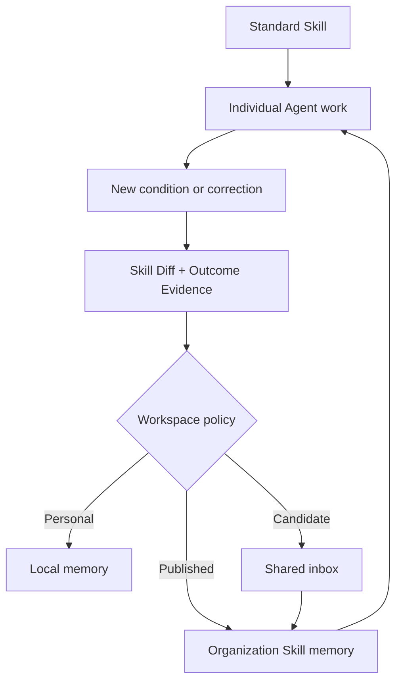

# Organization memory

ContextCommit's core job is not session storage. It captures reusable **Skill
Diffs** discovered in individual Agent work and promotes them into organization
memory.

A standard Skill contains the known workflow. Real work introduces new
conditions, exceptions, priorities, and decisions. These changes are already
expressed in prompts because a person needs a better result. Without a capture
loop, they remain with that person—which is why teams search for the right owner
and lose knowledge when people move or leave.

## Minimal promotion pipeline



The built-in `skill-diff-v1` policy uses signals already visible in the work:

- the Base Skill or workflow
- a condition that changed its logic
- a step, exception, priority, or decision rule added, changed, or removed
- a concrete `Reuse When`
- outcome evidence and validation
- sensitivity classification

No separate model, API, database, or per-session sharing prompt is required.
The Agent records the Skill Diff as part of the work; workspace policy handles
its lifecycle.

## Automatic routing

| Result | Location | Loaded by other Agents? |
| --- | --- | --- |
| No reusable Skill Diff or outcome evidence | Discarded | No |
| Outcome evidence without a Skill Diff, or a personal/sensitive change | Local `context-memory/` | No |
| Reusable but not validated | Shared `inbox/` | No |
| Reusable, validated, low-risk Skill Diff | Shared `knowledge/` | Yes |

`internal` and `public` items may be promoted. `private`, `confidential`,
and `restricted` items stay local. This metadata is a routing guard, not a
security boundary; storage permissions still control access.

## Workspace policy

A shared path defaults to team promotion:

```bash
context-commit init --shared "/mounted/company-context" --team "research"
```

An administrator can configure organization-wide promotion:

```bash
context-commit init --shared "/mounted/company-context" \
  --team "platform" --promotion-target organization
```

Team and organization scope are workspace policy, not a decision each person
must make after every session.

## Directory layout

```text
company-context/
├── inbox/
│   ├── team/<team>/<workspace>/<date>/<commit>.md
│   └── organization/<workspace>/<date>/<commit>.md
└── knowledge/
    ├── team/<team>/<workspace>/<date>/<commit>.md
    └── organization/<workspace>/<date>/<commit>.md
```

Only `knowledge/team/<current-team>/` and `knowledge/organization/` are
retrieved. Inbox candidates remain inspectable evidence but do not silently
change another person's Agent.

## Storage

Prompt Commits are plain Markdown, so the same contract works with:

- a dedicated SharePoint document library
- a private Git repository for engineering teams
- a controlled network drive for a pilot

ContextCommit writes the local copy first. Shared publication is retryable with
`context-commit sync`. Use separate roots or storage permissions for hard
access boundaries; metadata is not access control.

## Governance before broad rollout

1. Set the promotion target and allowed sensitivity classes centrally.
2. Assign ownership to a team or role, not only a person.
3. Review Inbox candidates, duplicate conditions, and false promotions.
4. Merge repeated Skill Diffs into a simpler shared rule instead of growing an
   unbounded IF–ELSE list.
5. Define how published rules are superseded or expired.
6. Keep raw Agent sessions local; share only extracted Prompt Commits.

The v0.6 pipeline stops at trustworthy published Skill Diffs. Compiling many
commits into a canonical `SKILL.md` can be added later without turning the
first version into a full knowledge-management platform.
